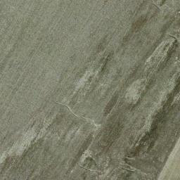
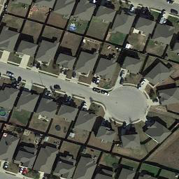
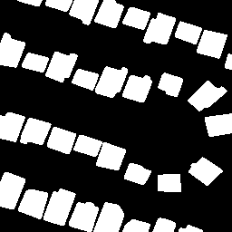
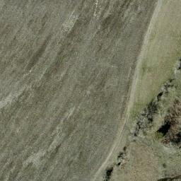
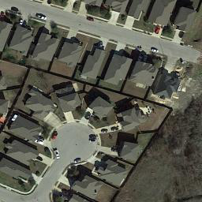
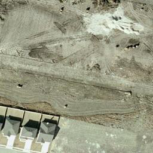
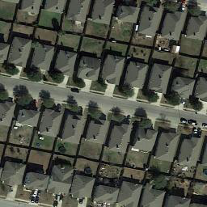
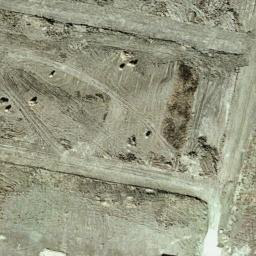
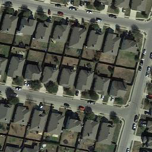
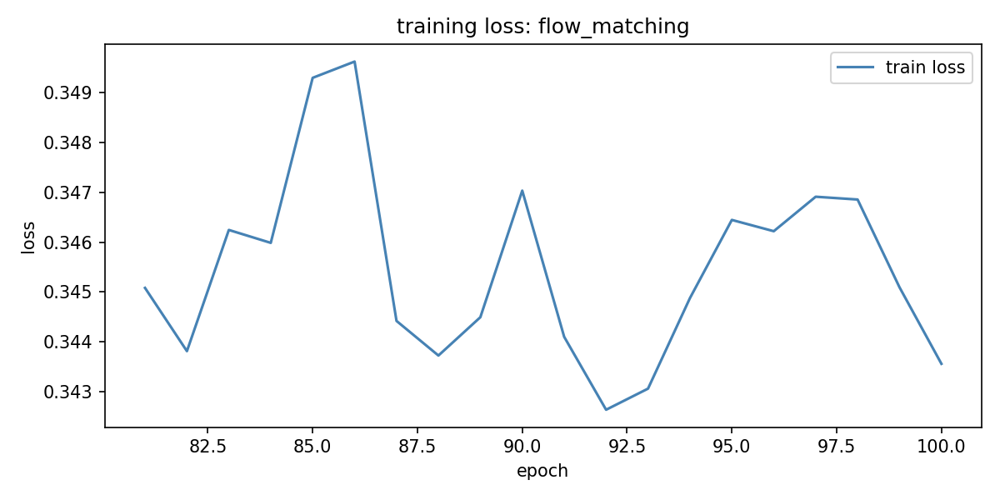

# Flow Matching for Bitemporal Satellite Image Synthesis
### MSML640 Final Project — Spring 2026 | University of Maryland
**Author:** Yaxita Amin

---

## What is this project?

Satellite images taken at different times of the same location can reveal changes on Earth — new buildings, deforestation, floods. But getting labeled pairs of these images is expensive and slow.

This project uses **flow matching** — a cutting-edge generative AI technique — to *synthesize* realistic pairs of satellite images, and tests whether adding these fake-but-realistic images improves an AI model's ability to detect real changes.

---

## How it works
Real Satellite Pairs → Train Flow Matching Model → Generate Synthetic Pairs
↓
Test if Synthetic Data Improves Change Detection

---

## Results

| Config | Description | F1 | IoU | Precision | Recall | Epochs |
|--------|-------------|-----|-----|-----------|--------|--------|
| 1 | Baseline | 0.8047 | - | - | - | 14 |
| 2 | Real + augmentation | 0.5838 | 0.4531 | - | - | 1 |
| 3 | Real + synthetic | 0.6516 | 0.5178 | 0.8068 | 0.5841 | 1 |
| 4 | Real + synthetic + aug | 0.5472 | 0.4100 | 0.5097 | 0.6649 | 1 |

> Note: Config 1 trained for 14 epochs, configs 2-4 for 1 epoch due to compute constraints. Full training is ongoing for publication extension.

---

## Dataset

**LEVIR-CD+** — large scale building change detection dataset
- 637 high resolution Google Earth image pairs
- 3,879 training patches after preprocessing
- 1,724 test patches

---
### Real bitemporal pairs from LEVIR-CD+
| T1 (Before) | T2 (After) | Change Mask |
|-------------|------------|-------------|
|  |  |  |
|  |  |  |
|  |  |  |
|  |  |  |

> White pixels in the mask = changed areas (new buildings appeared or disappeared).
> These patches were selected for having >20% change ratio for clear visualization.
## Model Architecture

- **Generator:** Flow Matching model with UNet backbone (55.8M parameters)
- **Evaluator:** UNet for binary change detection
- **Training:** NVIDIA A100-SXM4-40GB on UMD Zaratan HPC cluster

---

## Flow Matching Training

The generative model was trained for 100 epochs, with loss converging from 0.84 → 0.34:



---

## Project Structure
bitemporal_synthesis/
├── configs/          # hyperparameters
├── src/
│   ├── preprocessing/  # data loading and patching
│   ├── models/         # flow matching and change detection models
│   ├── training/       # training scripts
│   ├── generation/     # synthetic pair generation
│   └── evaluation/     # metrics and plots
├── scripts/          # slurm job scripts
└── outputs/plots/    # results and visualizations

---

## How to Run

### 1. Setup
```bash
module load python/3.10.10/gcc/11.3.0/cuda/12.3.0/linux-rhel8-zen2
module load cudnn
source venv/bin/activate
```

### 2. Download and preprocess data
```bash
python src/preprocessing/extract_data.py
python src/preprocessing/patch_and_filter.py
python src/preprocessing/compute_stats.py
```

### 3. Train flow matching model
```bash
python src/training/train_flow_matching.py
```

### 4. Generate synthetic pairs
```bash
python src/generation/generate_pairs.py
```

### 5. Train change detection (all 4 configs)
```bash
python src/training/train_change_detection.py
```

### 6. Evaluate and plot
```bash
python src/evaluation/evaluate.py
python src/evaluation/plot_curves.py
```

---

## References

- Lipman et al. (2023). Flow Matching for Generative Modeling. ICLR 2023.
- Chen et al. (2020). LEVIR-CD: A Large-Scale Dataset for Remote Sensing Change Detection.
- Amin et al. (2025). A Comparative Study of U-Net Architectures for Change Detection in Satellite Images. IET Conference Proceedings CP920.

---

## AI Usage Disclosure

UI components and auxiliary plotting/visualization code were generated with AI assistance (Claude, Anthropic). All core logic including flow matching implementation, change detection pipeline, preprocessing, dataset class, and evaluation was authored manually by Yaxita Amin.
